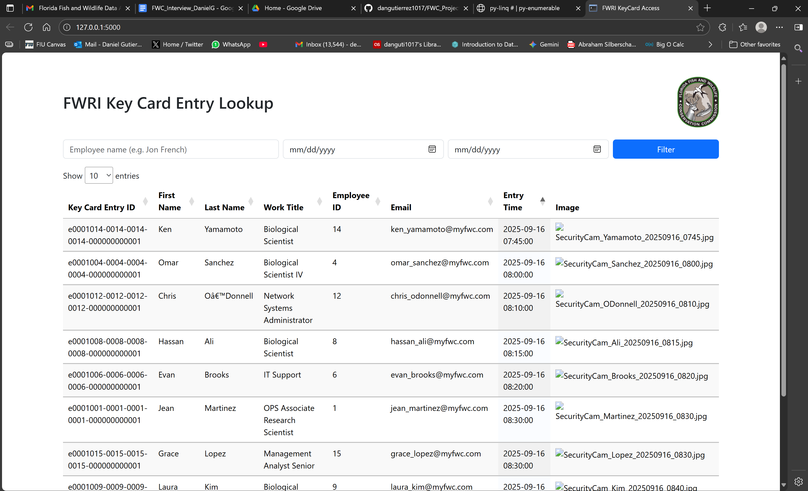
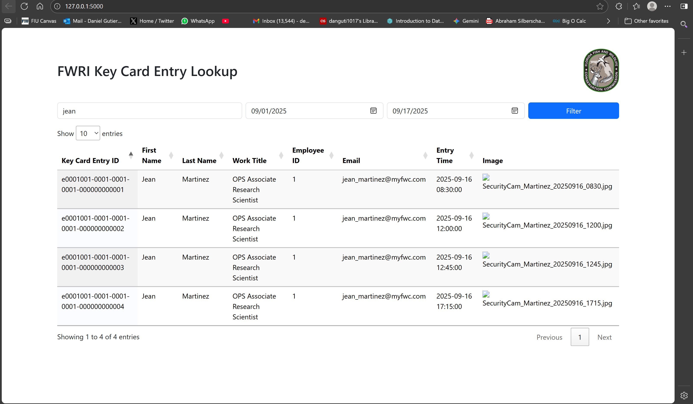

# FWRI Key Card Access Tracker
*A lightweight browser-based application for reviewing and filtering FWRI access records.*

---

## Overview
This project was developed as part of application design exercise for the Data Administration Analyst position
at the Florida Fish and Wildlife Conservation Commission.
The web app simulates how security staff and administrators at the Florida Wildlife Research Institute (FWRI) 
could efficiently search and review all keycard swipes that were used to enter and leave the building.

The application loads data from JSON files (representing database tables) and allows users to:

- Filter entries by **employee name** and/or **date range**
- Display **employee details**, **access timestamps**, and **security camera snapshots**
- View results interactively in a dynamic web-based table

---

## Tech Stack

| Category | Technology | Purpose |
|-------|-------------|----------|
| **Backend** | Flask (Python) | Web server, routing |
| **Data** | JSON + PyLinq | Database, LINQ query operations |
| **Frontend** | HTML/CSS, Bootstrap, jQuery, DataTables.js | Interactive UI and filtering |
| **Testing** | Jupyter Notebook, Pytest | Explorartory Data Analysis, Unit and Integration Testing |
| **Language** | Python | Core service logic, data ingestion and transformation pipeline |

---

## Design Approach: MVC
For this project, I based my application design on the MVC(Model, Structure, Views) architecture to keep all facets of this full-stack app
maintainable and scalable. By ensuring that logic for different components are kept seperate from each other, changes to one will not result in damage to the code integrity of other components, i.e updating one component will not break the other after successful integration testing.

This approach helped simplify the development of this app by allowing for ease of unit tests to try out different filtering queries and etc.

- **Model:**  
  The *data pipeline layer* in `src/services/`.  
  It loads JSON files (Employees, KeyCardEntries, Images, Categories) and uses PyLinq to perform in-memory joins and transformations, mimicking 
  .NET LINQ queries and more abstractly SQL queries.

- **View:**  
  The HTML interface (`src/views/index.html`) and the JavaScript logic (`src/static/entries.js`).  
  Responsible for rendering data, handling filters, making API requests to the backend, and displaying the user-facing frontend.
  
- **Controller:**  
  Flask route handlers in `src/controllers/routes.py`. Served as a bridge between the backend and frontend where requests were recieved
  for filters while calls were made to the service logic to populate new data to the web app's user interface.

> Browser -> Controller -> Model -> View

---

## How It Works
1. Data is loaded from JSON into Python dictionaries.  
2. PyLinq performs multi-table joins to simulate SQL queries.  
3. The resulting dataset is flattened backed to JSON format.
4. Flask renders the html into a developmental server and calls the service logic. 
5. The frontend JS script fetches data via JQuery and populates the DataTable dynamically.  
6. Filters are sent as query parameter requests (`name`, `start_date`, `end_date`) to the `/api/entries` endpoint.
7. New filtered JSON data is called to update DataTable.

---

## Instructions

### 1. Clone the Repository
Open Terminal:
- git clone https://github.com/dangutierrez1017/FWC_Project.git
- cd FWC_Project

### 2. Create and Activate Virtual Environment
- python -m venv venv
- myenv\scripts\activate

### 3. Install Dependencies
- pip install -r requirements.txt

### 4. Run the Application
- python app.py
- Open http://127.0.0.1:5000 on your browser
- Enjoy!

---

## Project Demo

